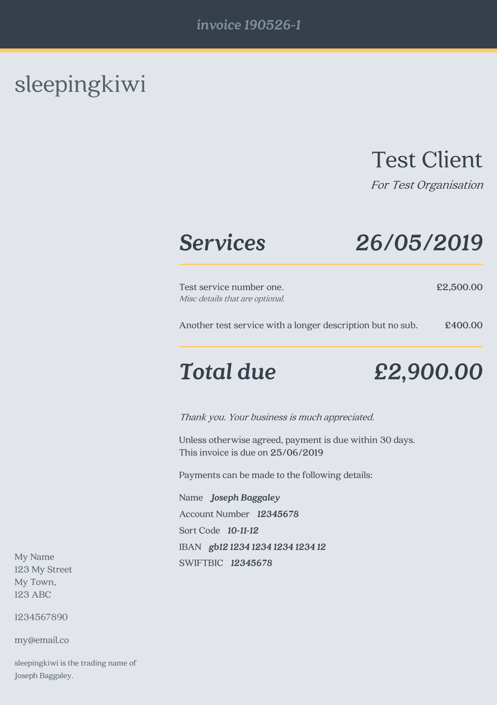

# Admin, utilities, invoicing etc.

Tools and resources for my freelance work.

Largely adapting or improving upon the resources that [Tedworth & Oscar](https://tedworthandoscar.co.uk) use. As things are updated, cleaned up or improved they'll hopefully find their way in here...

## Terms of Agreement

Adapted (barely) from Andy Clarke's [open-source contract](https://stuffandnonsense.co.uk/projects/contract-killer)

## Invoicing

Produces HTML invoices that I print out or save to PDF.

💌 **Uses the font [Quincy CF](https://connary.com/quincy.html).**

The [css](invoicing/style.css) expects Quincy to be installed locally and will fallback to system serif unless you substitute another font.

### Making an invoice

> **If you're not me** - you'll probably want to change some of the things that are hardcoded in to the html!

- Populate a json file using the [example file](invoicing/json/_test-data.json) as a reference.
- Run [`index.html`](invoicing/index.html) in your browser of choice (you can use [this link](https://htmlpreview.github.io/?https://github.com/sleepingkiwi/sleepingkiwi-admin/main/invoicing/index.html) to run it without having to download the repo).
- Drop your json file in to generate an invoice
- Print to PDF (Chrome seems to work best)
